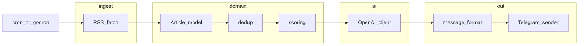

# Neurofeed: development phases and agent documentation

## Context

The product vision and technical stack are defined in [docs/neurofeed.md](../../docs/neurofeed.md): Go, RSS via [gofeed](https://github.com/mmcdole/gofeed), scheduling (cron or [gocron](https://github.com/go-co-op/gocron)), `net/http` for APIs, OpenAI for summaries, Telegram Bot API for delivery. Success is measured by signal quality (filter + summarize), not raw volume.

## Target architecture (packages)

Keep boundaries explicit so each phase has a clear home and tests stay small:

Suggested layout (to implement after plan approval, not in this planning step):

- `cmd/neurofeed/` — thin `main`: parse flags/env, wire deps, run job once or on schedule
- `internal/config/` — validated configuration (feeds, tokens, timeouts, model name)
- `internal/ingest/` — RSS → `Article` (timeouts, user-agent, errors)
- `internal/domain/` — `Article`, dedup key normalization, scoring
- `internal/ai/` — provider-agnostic LLM client(s), prompt templates from [docs/neurofeed.md](../../docs/neurofeed.md) (base + advanced)
- `internal/notify/` — Telegram send, Markdown/HTML escaping per [Telegram Bot API](https://core.telegram.org/bots/api) rules
- `internal/app/` or `internal/pipeline/` — orchestration: collect → dedup → score → top N → summarize → format → send

Use **interfaces at boundaries** (e.g. `FeedFetcher`, `Summarizer`, `Notifier`) with concrete implementations in the same or adjacent packages so tests can use fakes without global state.

---

## Development phases

Phases below **merge** the roadmap in [docs/neurofeed.md](../../docs/neurofeed.md) with engineering work (config, structure, quality) so “maximum Go” applies from day one.

| Phase | Goal | Outcomes |
|-------|------|----------|
| **0 — Repo and quality baseline** | Runnable module, conventions locked | `go.mod`, minimal `main`, `.gitignore`, `docs/RULES.md` / `docs/SKILLS.md` / `AGENTS.md` (this plan’s deliverables), optional `Makefile` or `task` for `fmt`, `vet`, `test`. No feature code without `context.Context` on I/O boundaries. |
| **1 — MVP** | One path end-to-end | Telegram bot created; send one test message; fetch **one** RSS URL with gofeed; map to `Article`; send title + link to Telegram. Config via env (bot token, feed URL). |
| **2 — Multiple sources** | Scale ingestion | Multiple feeds from config (YAML/JSON or env list) **each with a source tier** (`primary` / `expert` / `news` / `community` per [docs/neurofeed.md](../../docs/neurofeed.md)); map to `Article` including `SourceTier`; dedup by normalized title (lower, strip punctuation; optional hash later). |
| **3 — Smart filter** | Relevance without LLM | Positive/negative keywords, scoring **plus tier weights** (`SourceTier.ScoreWeight()` defaults; **overridable per profile/config** per [docs/neurofeed.md](../../docs/neurofeed.md)), sort by score, cap top N; optional per-feed bonus and recency bonus as in the doc. |
| **4 — AI integration** | Summaries | OpenAI HTTP calls with timeouts; prompt from spec (structured output); validate length/clarity with simple heuristics or JSON mode if you standardize output. |
| **5 — Message UX** | Readable digest | Categories, emojis, Markdown (or HTML) with Telegram-safe formatting; clickable links. |
| **6 — Personalization** | Multi-audience | Profiles; **up to 5 interest topics** per profile (Telegram UX: **catalog + search** as primary, optional limited free-text per [docs/neurofeed.md](../../docs/neurofeed.md)); map interests → keyword/synonym lists; **tier weight overrides**; per-profile feed subsets. |
| **7 — Robustness** | Production habits | Retries with backoff for transient HTTP failures, structured logging (`log/slog`), request timeouts everywhere, simple TTL cache if needed to avoid duplicate API work. |

**Go-specific emphasis across phases**

- **Errors**: `%w` wrapping, sentinel errors where appropriate, no silent `_` on I/O.
- **Context**: every outbound HTTP and LLM call accepts `context.Context`.
- **Types**: small structs, constructor functions for clients, avoid `interface{}` unless justified.
- **Testing**: table-driven tests for scoring/dedup/formatting; `httptest` for HTTP clients; inject clocks for time-based scoring.
- **Concurrency**: if parallel feed fetch, use bounded worker pattern or `errgroup` with context cancellation; document limits.
- **Documentation**: package comments on `internal/*` roots; exported symbols documented only where API is non-obvious.

---

## docs/RULES.md (planned contents)

Single source of truth for **how we write Go in this repo** (file: [docs/RULES.md](../../docs/RULES.md)):

- Module layout (`cmd/` vs `internal/`), naming, and when to add a new package.
- Error handling, logging (`slog`), configuration (env + optional file), secrets (never committed).
- HTTP: timeouts, default transport considerations, retries policy (where and max attempts).
- Telegram and LLM providers: rate limits, message length split strategy if digest exceeds limits.
- Testing expectations (what must be tested per change type), `go vet` / `staticcheck` if adopted.
- Dependencies: prefer stdlib + minimal deps; justify new modules.

Optional later: mirror critical bullets into [`.cursor/rules/*.mdc`](https://cursor.com/docs) for editor-native hints; **docs/RULES.md** remains the canonical human-readable contract.

---

## docs/SKILLS.md (planned contents)

**Index of repeatable workflows** for humans and agents (file: [docs/SKILLS.md](../../docs/SKILLS.md)):

- How to add a new RSS source and redeploy/run locally.
- How to tune keywords and top-N without code changes (if config-driven).
- How to run the daily job manually vs on schedule.
- How to rotate Telegram/OpenAI tokens safely.
- Pointers to prompt templates location and how to A/B base vs advanced prompt.
- “Definition of done” checklist per phase (maps to success criteria in [docs/neurofeed.md](../../docs/neurofeed.md)).

If you later add real [Cursor Agent Skills](https://cursor.com/docs) under `.cursor/skills/`, **docs/SKILLS.md** should link to those paths and one-line descriptions.

---

## AGENTS.md (planned contents)

**Instructions for AI coding agents** working in this repository:

- Read **docs/RULES.md** first; follow **docs/SKILLS.md** for operational steps (see [AGENTS.md](../../AGENTS.md) at repo root).
- Scope: prefer minimal diffs; match existing patterns; do not add unsolicited docs beyond what the team requests.
- Language: Go version target (state explicit version in AGENTS.md once chosen, e.g. 1.22+).
- Testing: run/format commands the project standardizes on.
- Security: never echo secrets; use env placeholders in examples.
- When to propose new packages vs extending an existing one (tie to architecture diagram above).

This complements Cursor’s native rules: **AGENTS.md** is repo-level “agent README”; **docs/RULES.md** is coding law; **docs/SKILLS.md** is procedure.

---

## Implementation order (after you approve)

1. Add **docs/RULES.md**, **docs/SKILLS.md**, **AGENTS.md** (repo root) with the sections above, tuned to your chosen Go version and scheduler (cron binary vs gocron in-process).
2. Scaffold **Phase 0** (`go.mod`, `cmd/neurofeed`, `internal/config`, minimal pipeline stub).
3. Execute phases **1–7** sequentially, merging “robustness” practices (timeouts, context) from phase 0 onward rather than deferring all to phase 7.

---

## Risks and decisions (non-blocking for the plan)

- **Telegram message length**: plan chunking or “continued” messages early in phase 5.
- **OpenAI cost**: cap articles per run and token limits in phase 4 config.
- **Scheduler**: systemd/cron wrapping a binary vs embedded gocron affects deployment docs in **docs/SKILLS.md**—call out both options there until you pick one.

After plan approval, the first concrete edits were the handbooks under **docs/** plus **AGENTS.md** and Phase 0 scaffold.
